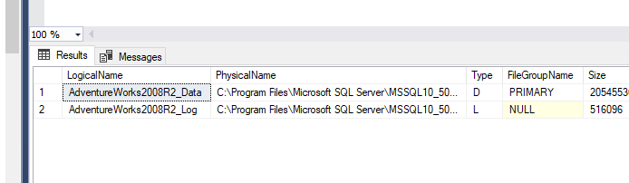

# MSSQL - Restore a Database in a Docker Container

# Preqrequisites

- Running Docker of MSSQL Server
- Backup file of the database to restore
- The name of the docker container (replace all `YOUR_CONTAINER_NAME` in the following examples)

## Copy the file in the container

```bash
docker cp YourData.bak sqlserver:/var/opt/mssql/data
```

## Restore the database without SSMS

1. Connect to the database with your favorite SQL client (e.g. Azure Data Studio, SQL Server Management Studio, DataGrip, etc.)
2. Get the list of files in the backup file

```sql
RESTORE FILELISTONLY FROM DISK = '/var/opt/mssql/data/YourData.bak';
GO
```



3. For each row in the result, Add a `MOVE` statement to the `RESTORE` command
   (for the example above, the command would be)

```sql
RESTORE DATABASE YourData
FROM DISK = '/var/opt/mssql/data/YourData.bak'
WITH MOVE 'YourData_Data' TO '/var/opt/mssql/data/YourData.mdf',
MOVE 'YourData_Log' TO '/var/opt/mssql/data/YourData_Log.ldf'
GO
```
